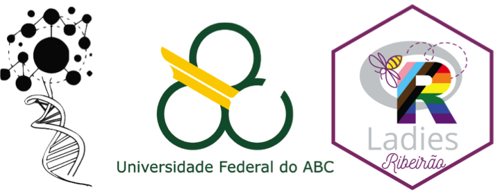
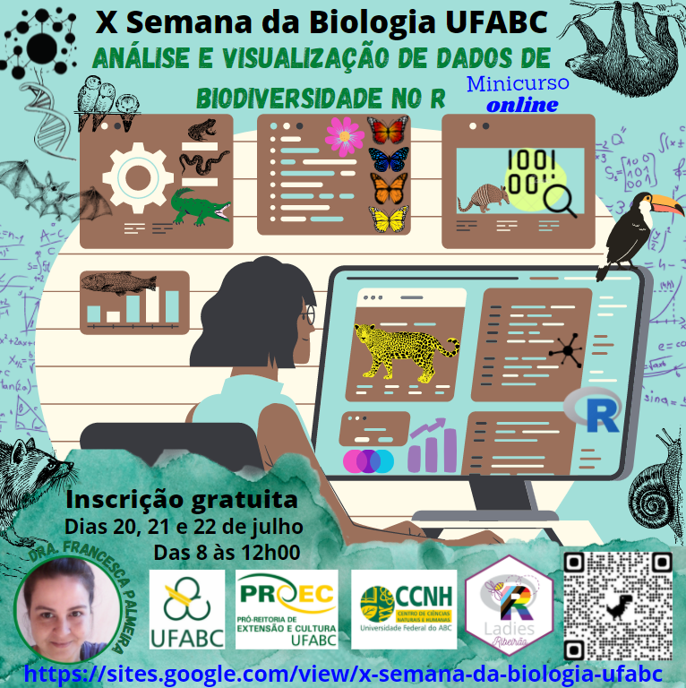

# [X Semana da Biologia UFABC - 2021](https://sites.google.com/view/x-semana-da-biologia-ufabc/xsbioufabc)


## [Minicurso: Análise e visualização de dados de biodiversidade no R (12 horas)](https://sites.google.com/view/x-semana-da-biologia-ufabc/minicursos?authuser=0#h.aobl38szjvvm)
### Francesca B. L. Palmeira


EMENTA: Este curso tem como objetivo oferecer um treinamento prático no uso da linguagem de programação R com a finalidade de: i) analisar dados de biodiversidade; ii) gerar modelos ecológicos dentro de três níveis de organização biológica (organismos/indivíduos, populações e comunidades); iii) visualizar dados construindo figuras e gráficos de alto impacto visual; iv) interpretar os resultados; e, v) discutir as aplicações biológicas das análises e dos modelos. O conteúdo programático inclui a: i) realização de análises exploratórias, ii) introdução à diferentes famílias de modelos ecológicos aplicados a armadilhas de captura, armadilhamento fotográfico, transectos lineares, coleta de fezes, coleta de animais mortos (predados ou atropelados), telemetria, dados de museu, pontos de contagem, parcelas de amostragens, entre outros métodos de coleta; iii) preparação de dados (input) específica para cada análise e modelo; iv) seleção e o ajuste de cada modelo utilizando as inferências da Estimativa da Máxima Verossimilhança (MLE – Maximum Likelihood Estimation) e Bayesiana; e, v) visualização gráfica de dados, interpretação dos resultados (output) e suas aplicações biológicas. Para a realização dos exercícios práticos, é recomendável que cada participante utilize um computador (desktop ou laptop) ao invés de um celular. Não será necessário fazer a instalação do R no computador uma vez que utilizaremos o RStudio Cloud, uma versão online. Não é necessário ter conhecimento prévio de R ou estatística. Será oferecido um tutorial com o passo a passo de todos os exercícios realizados durante o curso.

PÚBLICO-ALVO: Estudantes de graduação, pós-graduação e profissionais com interesse em análise e visualização de dados de biodiversidade.

PRÉ-REQUISITOS: Não tem pré-requisito

CRITÉRIOS DE SELEÇÃO: 1) Priorizar grupos subrepresentados no uso do R (ex. mulheres cis, mulheres trans, pessoas não-binárias, pessoas de baixa renda e/ou pessoas que se auto declarar como parte de grupos subrepresentados) - critérios utilizados pelas RLadies; 2) Ordem de inscrição.

JUSTIFICATIVA: O avanço tecnológico dos últimos anos facilitou o nosso acesso a equipamentos modernos de campo e a ferramentas gratuitas para a análise de dados. Aliado a este fato, existe uma quantidade enorme de dados de biodiversidade disponíveis em diversos repositórios online. Desta forma, o uso da linguagem R tem sido extremamente útil para analisar e visualizar toda essa quantidade de dados disponíveis, além de possibilitar maior transparência e reprodutibilidade no processo de análise.

NÚMERO DE VAGAS: 200

CARGA HORÁRIA: 12 horas

MATERIAIS:

- [Ementa do curso `.pdf`](https://github.com/fblpalmeira/SBMGC_2021/blob/main/1_Ementa_Workshop_R_SBMGC_2021.pdf)

- [Tutorial do RStudio Cloud `.pdf`](https://github.com/fblpalmeira/SBMGC_2021/blob/main/2_Tutorial_RStudioCloud_Pronta_Cientista_2021.pdf)

- [Aula teórica  `.pdf`](https://github.com/fblpalmeira/SBMGC_2021/blob/main/3_Aula_Teorica_Modelos.pdf)

EXERCÍCIO: O objetivo da nossa aula prática é construir esse gráfico 3D que representa a rede de interações ecológica da onça-pintada (Panthera onca) com dados de literatura compilados por [Palmeira 2015](https://www.teses.usp.br/teses/disponiveis/11/11150/tde-17092015-111206/publico/Francesca_Belem_Lopes_Palmeira_versao_revisada.pdf).

- [Código `.R`](https://github.com/fblpalmeira/foodweb/blob/main/jaguar_foodweb.R)

- [Planilha `.csv`](https://github.com/fblpalmeira/foodweb/blob/main/jaguar_foodweb.csv)


## Instalação

Instale o pacote 'foodweb' do `R`:

``` r
# install.packages("foodweb")
library(foodweb)
```

REFERÊNCIAS:

[Palmeira FBL, 2015.](https://www.teses.usp.br/teses/disponiveis/11/11150/tde-17092015-111206/publico/Francesca_Belem_Lopes_Palmeira_versao_revisada.pdf) Coocorrência, interações tróficas e distribuição potencial da onça-pintada (Panthera onca) no bioma Amazônia. Tese de Doutorado, Universidade de São Paulo (USP).

[Perdomo G, 2012.](https://cran.r-project.org/web/packages/foodweb/foodweb.pdf) Package 'foodweb'.
